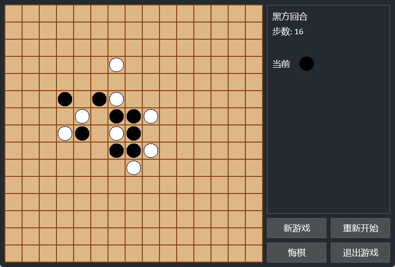

<div align="center">

<h1>简易五子棋AI游戏</h1>


</div>

---

# 📋 一、项目概述

一个使用Python和Arcade库开发的五子棋游戏，采用Clean Code架构设计，集成MCP服务器支持LLM对战。

> 🚨 **重要说明**
> 
> **整个项目99%的代码和文档都是由AI生成的！** 🤖 
> 
> 本项目是一个AI代码生成能力的完整展示，由DeepSeek AI模型（DeepSeek-V3.2）通过对话式开发完成。所有代码生成过程都记录在 [`CodeGeneration.md`](./CodeGeneration.md) 文件中，包括：
> 
> - 完整的项目架构设计
> - 分层代码实现（UI、逻辑、配置、MCP服务器）
> - 代码重构和优化过程
> - 问题诊断和修复
> - MCP服务器集成
> 
> 这个项目证明了AI在软件开发中的强大能力，能够：
> - 理解复杂的架构要求
> - 实现Clean Code标准
> - 进行代码重构和优化
> - 集成现代技术栈（MCP服务器）
> - 解决实际问题

## 1.1  功能特点

- 完整的五子棋游戏逻辑
- 美观的中文界面
- 支持悔棋功能
- 可配置的游戏设置
- 详细的日志记录
- 分层架构设计，易于维护和扩展
- **集成MCP服务器，支持SSE方式对接LLM进行对战**
- **游戏窗口与MCP服务器生命周期绑定**

## 1.2  项目结构

```text
SimpleGomoku/
├── python/                           # 源代码目录
│   ├── main.py                       # 程序入口点
│   ├── core/                         # 游戏主要逻辑
│   │   ├── Board.py
│   │   └── GameLogic.py
│   ├── models/                       # 数据模型
│   │   └── GameModels.py
│   ├── ui/                           # UI层
│   │   ├── GameWindow.py             # 游戏窗口
│   │   └── components/               # UI组件
│   │       ├── BoardView.py
│   │       ├── Button.py
│   │       └── StatusPanel.py
│   ├── util/                         # 工具类
│   │   ├── Config.py                 # 配置管理
│   │   └── Logger.py                 # 日志管理
│   └── server/                       # MCP服务器层
│       └── McpServer.py              # MCP服务器管理器
├── resources/                        # 资源文件
│   ├── HarmonyOS_SansSC_Regular.ttf  # 中文字体
│   ├── LICENSE.txt                   # 中文字体许可证
│   └── config.properties             # 配置文件
├── requirements.txt                  # 项目依赖
├── CodeGeneration.md                 # LLM代码生成过程
├── README.md                         # 说明文档
└── LICENSE                           # 许可证
```

# ⚙️ 二、安装和运行

## 2.1  安装依赖

```bash
pip install -r requirements.txt
```

## 2.2  运行游戏

```bash
cd python
python main.py
```

或者直接运行：

```bash
python python/main.py
```

## 2.3  MCP服务器

游戏启动时会自动启动MCP服务器（端口60000），支持SSE方式对接。LLM可以通过以下方式与游戏交互：

**SSE连接地址：**
```
http://localhost:60000/sse
```

**可用工具：**
- `get_game_state` - 获取当前游戏状态
- `make_move` - 在指定位置落子
- `get_available_moves` - 获取所有可用位置
- `start_new_game` - 开始新游戏
- `restart_game` - 重新开始游戏
- `undo_move` - 悔棋一步
- `get_game_info` - 获取游戏详细信息

**示例客户端：**
```bash
python python/server/McpClientExample.py
```

# 🎯 三、游戏操作

## 3.1  操作

- **鼠标点击**：在棋盘上落子
- **新游戏**：开始全新的游戏
- **重新开始**：重置当前游戏
- **悔棋**：撤销上一步操作
- **退出游戏**：关闭游戏窗口

## 3.2  快捷键

- **ESC**：退出游戏
- **R**：重新开始游戏
- **N**：新游戏
- **Ctrl+Z**：悔棋

# ⚙️ 四、配置说明

## 4.1  配置文件

游戏的所有可配置项都在 `resources/config.properties` 文件中，包括：

- 窗口大小和标题
- 棋盘大小和颜色
- 棋子颜色和大小
- 按钮样式
- 界面文本（支持中文）
- 游戏规则（获胜连子数等）

修改配置文件后，重启游戏即可生效。

## 4.2  架构设计

项目采用分层架构设计：

1. **配置层** (`Config.py`)：集中管理所有配置
2. **日志层** (`Logger.py`)：统一的日志记录
3. **数据模型层** (`models/`)：定义游戏数据结构
4. **业务逻辑层** (`Board.py`, `GameLogic.py`)：游戏核心逻辑
5. **UI层** (`ui/`, `GameWindow.py`)：用户界面组件
6. **MCP服务器层** (`mcp/`)：提供SSE接口供LLM对战
7. **入口点** (`main.py`)：程序启动

这种设计使得：
- 各层职责清晰，易于维护
- 可以轻松更换UI框架
- 配置集中管理，易于修改
- 代码高度可复用
- **MCP服务器与游戏逻辑完全解耦**
- **UI操作和MCP操作调用相同的游戏逻辑方法（源码级复用）**
- **游戏窗口与MCP服务器生命周期绑定**

# 💻 五、开发说明

## 5.1  代码规范

- 遵循Clean Code原则
- 使用大驼峰命名法（类名）
- 每个类一个文件
- 所有import从python目录开始
- 使用Logger代替print

## 5.2  扩展游戏

1. **添加新功能**：在相应的层中添加代码
2. **修改UI**：修改ui目录下的组件
3. **更改配置**：修改config.properties文件
4. **添加新游戏模式**：扩展GameLogic类
5. **扩展MCP接口**：在`McpServer.py`中添加新的工具函数

## 5.3  MCP服务器开发

MCP服务器实现了严格的代码分层：

1. **游戏逻辑复用**：MCP服务器调用的`make_move`、`undo_move`等方法与UI操作调用的是同一个`GameLogic`类的方法
2. **生命周期管理**：MCP服务器在游戏窗口启动时自动启动，在窗口关闭时自动停止
3. **错误处理**：所有MCP工具都有完善的错误处理
4. **线程安全**：MCP服务器运行在独立线程中，不影响UI主线程

要添加新的MCP工具，只需在`McpServer.py`中添加新的装饰器函数：

```python
@self.mcp.tool()
def new_tool(param1: str, param2: int) -> Dict[str, Any]:
    """工具描述"""
    try:
        # 调用游戏逻辑层的方法
        result = self.game_logic.some_method(param1, param2)
        return {"success": True, "result": result}
    except Exception as e:
        return {"success": False, "error": str(e)}
```

# 📜 六、许可证

本项目仅供学习使用，遵循MIT许可证 - 详见 [LICENSE](./LICENSE) 文件。

# 🤝 七、贡献指南

1. Fork 本仓库
2. 创建功能分支：`git checkout -b feature/新功能`
3. 提交更改：`git commit -m '添加新功能'`
4. 推送到分支：`git push origin feature/新功能`
5. 提交 Pull Request

# 📞 八、联系方式

如有问题或建议，请提交GitHub Issue。

---


